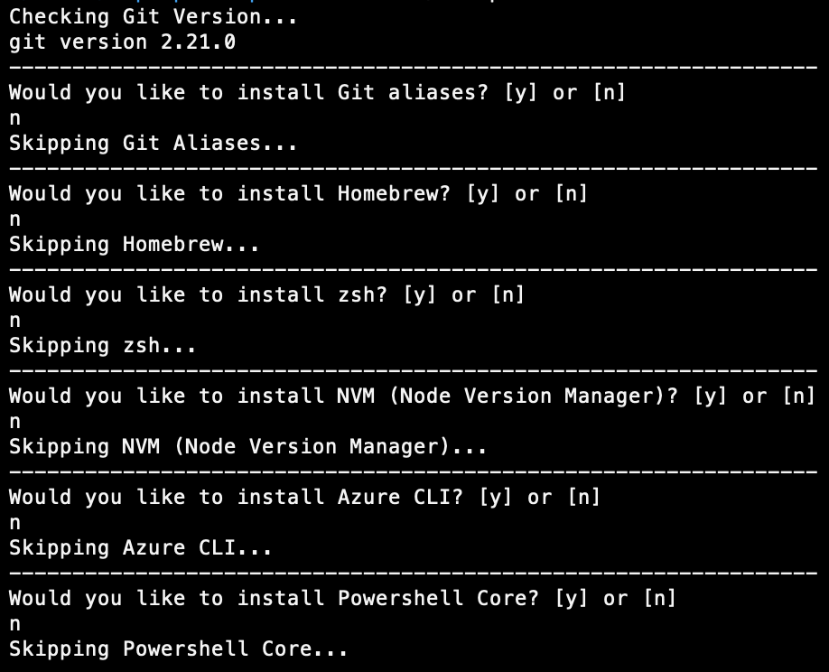

# Laptop Setup

## Execution 

This repository contains a bash script for setting up a front-end dev Macbook.

To run the script, first set the permissions on the **setup.sh** by running:

```
chmod +x ./setup.sh
```

Then execute the script by navigating to the project root and run:

```
./setup.sh
```

## About

The installer will run through a series of standard tools and install them onto your machine. Each tool will ask if you want it, before it is installed. Respond to each question with either `y` Yes, or `n` No. Replying with No will skip the install.



### Tools

**Scripted Installations:**
* Show hidden files in MacOS
* Accept XCode license (required for all other scripts to run)
* Git
  * Setup Git aliases
  * Setup a work and a personal Git profile
* Hombrew
* zsh & Oh-my-zsh
* NVM (Node Version Manager)
    * Install LTS
    * Install 8.16.1
* Azure CLI
* Powershell Core
* VS Code
  * Add `code` to PATH 
  * Setup Keybindings
  * Setup Settings
  * Install extensions
* Postman

**Manual Installations:**
* Docker
* Chrome
* Firefox
* Azure Data Studio
* Azure Storage Explorer
* MySQL Workbench
* Charles Proxy
* Slack
* Draw.io
* Abstract
* Dropbox
* Spotify
* Whatsapp


### TODO:

* [ ] XCode
* [ ] Visual Studio Enterprise
